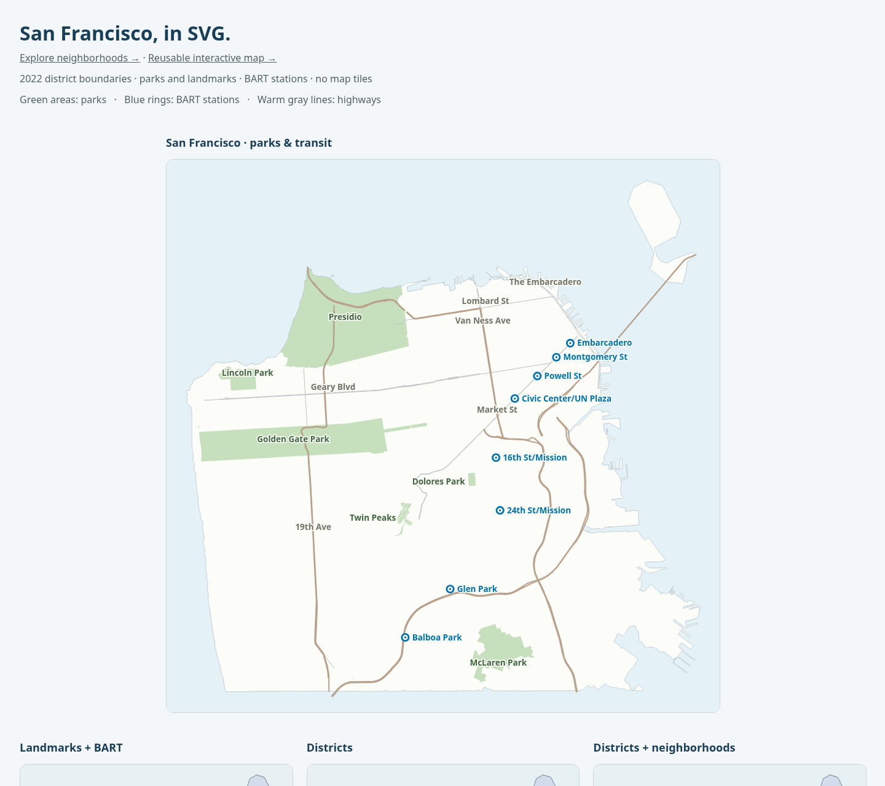

# San Francisco SVG maps

[](https://www.npmjs.com/package/@kahwee/sf-map-svg)

[Explore the live map](https://kahwee.github.io/sf-map-svg/) · [Data guide](data/README.md) · [Geographic sources](SOURCES.md) · [Contributing](CONTRIBUTING.md)

Self-contained SVG maps of San Francisco, with precise coastlines, soft district colors, parks, roads, BART stations, and searchable neighborhoods. Render static SVGs in Node or add an interactive map to a browser. All geometry is bundled; there are no runtime dependencies, map tiles, API keys, or external data requests.



## Install

```sh
pnpm add @kahwee/sf-map-svg
```

Use Node 22.12+ for server-side rendering. Browser components need a DOM and a bundler that supports the package’s JSON imports.

| Start with | Entry point | What you get |
| --- | --- | --- |
| Static SVG | `@kahwee/sf-map-svg` | SVG markup, projection helpers, optional layers |
| Data-injected SVG | `@kahwee/sf-map-svg/custom-map` | Tree-shakeable renderer core with only the geographic data you provide |
| Neighborhood explorer | `@kahwee/sf-map-svg/explorer` | Search, source selection, map controls, GeoJSON downloads |
| Interactive map | `@kahwee/sf-map-svg/interactive` | Embeddable map and controls without the explorer sidebar |
| Data-injected interactive map | `@kahwee/sf-map-svg/interactive-data` | Interactive shell without bundled geographic JSON |
| Lightweight guide map | `@kahwee/sf-map-svg/guide` | Curated overview geography, with detailed data loaded explicitly |
| Animated transit demo | `@kahwee/sf-map-svg/transit` | Optional, schematic BART journey with playback controls |
| Geographic data | `@kahwee/sf-map-svg/data` | Source-aware lookup and canonical GeoJSON |

## Render a static map

```js
import { writeFile } from 'node:fs/promises';
import { renderSFMap } from '@kahwee/sf-map-svg';

const svg = renderSFMap({
  landmarks: true,
  bartStations: true,
  highways: true,
  neighborhoodLines: true,
  markers: [{ id: 'dolores', lng: -122.4269, lat: 37.7596, label: 'Dolores Park' }],
});

await writeFile('san-francisco.svg', svg);
```

For smaller browser bundles, import `createSFMapWithData` from
`@kahwee/sf-map-svg/custom-map` and pass only the geographic assets your map uses.
That entry point does not import the package's built-in JSON collections. Its `SFMapData`
requires the coast and accepts selected district vintages plus optional neighborhood,
road, park, and station arrays. Use the canonical JSON subpaths documented in
[`data/README.md`](data/README.md) as source; map each feature collection to the
corresponding `SFMapData` records. The root entry remains convenient and includes the
built-in datasets for backward compatibility.

The same split is available for browser controls with
`@kahwee/sf-map-svg/interactive-data`. Pass an `InteractiveSFMapData` object containing
`map` (the `SFMapData` used by the static renderer) and only the neighborhood collections
you want available. This keeps alternative neighborhood sources, unused district vintages,
and optional layers out of that entry's bundle. The normal `/interactive` entry retains its
built-in datasets and synchronous source switching.

For the curated guide map, import `@kahwee/sf-map-svg/guide`. Its overview preset contains
only the simplified coastline, SFAR areas, major parks, BART points, US 101 / I-280 /
Highway 1, and Market, Van Ness, Geary, Lombard, 19th Avenue, and the Embarcadero. It does
not import historical districts, other neighborhood sources, or the full street network.
Collision-filtered neighborhood labels are enabled by default. Road geometry and road labels
have independent `layers.keyRoads` and `layers.roadLabels` controls. Lombard geometry and its
label appear after 1.8× zoom; major street labels can appear at city scale in a smaller type size.

```ts
import { createGuideMap, loadGuideDetailedData } from '@kahwee/sf-map-svg/guide';
import { createInteractiveSFMapWithData } from '@kahwee/sf-map-svg/interactive-data';

const map = createGuideMap({ layers: { roadLabels: false } });
document.querySelector('#map')!.append(map);

// Load only when the user asks for closer geographic detail.
const detailedData = await loadGuideDetailedData();
const detailedMap = createInteractiveSFMapWithData(detailedData, {
  mode: 'neighborhoods',
  layers: { highways: true, keyRoads: true, roadLabels: true },
});
```

Run `pnpm data:guide` to rebuild the subpixel overview geometries from canonical files.
`docs/guide-bundle-report.md` records compressed bundle sizes and verifies the included data.

```js
import coast from '@kahwee/sf-map-svg/data/coast.json' with { type: 'json' };
import realtor from '@kahwee/sf-map-svg/data/neighborhoods-realtor.json' with { type: 'json' };
import { createInteractiveSFMapWithData } from '@kahwee/sf-map-svg/interactive-data';

const map = createInteractiveSFMapWithData(
  {
    map: { coast: coast.features[0].geometry },
    neighborhoods: { realtor },
  },
  {
    layers: {
      districtFills: false,
      districtLines: false,
      districtLabels: false,
      landmarks: false,
      bartStations: false,
      highways: false,
      keyRoads: false,
    },
  },
);
document.querySelector('#map').append(map);
```

Embed the returned SVG markup directly in a page; in Astro, use `<div set:html={svg} />`. User-supplied text and attributes are XML escaped. Use a distinct `idPrefix` for each map when combining independently rendered SVGs.

## Static options

| Option | Default | Purpose |
| --- | --- | --- |
| `year` | `2022` | District boundaries: `2002`, `2012`, or `2022` |
| `districtLines` | `true` | Supervisorial district outlines |
| `neighborhoodLines` | `false` | Dashed SFAR realtor neighborhood outlines |
| `theme` | `'districts'` | Use `'transit'` for pale blue water, ivory land, green parks, and blue BART symbols; custom `colors` still take precedence |
| `districtFills` | `true` | Original Site’s eleven muted district colors |
| `labels` | `true` | Master switch for visible map text; symbols and accessible titles remain |
| `districtLabels` | `true` | District number badges |
| `highways` | `false` | Original Site’s highway geometry |
| `landmarks` | `false` | Golden Gate Park, Presidio, Lincoln Park, Twin Peaks, Dolores Park, and McLaren Park |
| `bartStations` | `false` | Eight San Francisco BART stations with blue rings and names |
| `width`, `height` | `800`, `800` | SVG viewBox and intrinsic size |
| `padding` | `28` | Space around the coast |
| `markers` | `[]` | Points with `id`, `lng`, `lat`, optional `label`, `color`, `selected` |
| `keyRoads` | `false` | Six selected street corridors: Market, Van Ness, Geary, Lombard, 19th Avenue, and the Embarcadero |
| `roadLabels` | Same as `keyRoads` | Road labels independently of their geometry |
| `colors` | Built-in palette | Override `water`, `land`, `district`, `neighborhood`, `highway`, `road`, `park`, `landmark`, `bart`, `label`, `marker`, `selected` |
| `title` | `San Francisco map` | Accessible SVG title |
| `idPrefix` | Unique per process | Set explicitly for deterministic output or independent server renders |

For a plain outline map, set `districtFills: false`. Neighborhood areas are **August 2010 SFAR realtor areas**, not legal boundaries or a historical layer matched to the district year. See [SOURCES.md](SOURCES.md).

`createSFMap(options)` returns `{ svg, project, viewBox }`. `project([longitude, latitude])` gives matching SVG coordinates for custom overlays. Named exports also include `districtYears`, `districtColors`, and `neighborhoodNames`.

Use `theme: 'transit'` for pale water, ivory land, green parks, and blue BART symbols. Custom `colors` override the preset. Park and station overlays represent current source geography, independently of the district year; stations outside San Francisco, including Daly City, are excluded.

`keyRoads: true` adds the six curated orientation streets using DataSF centerlines. These are orientation features, not routing guidance. The lightweight guide shows primary corridors at city scale and Lombard after zooming.


## Neighborhood explorer

The browser explorer includes canonical-name and alias search, source selection, neighborhood outlines, zoom controls, and GeoJSON downloads. SFAR realtor definitions are selected by default; SF Find and analysis neighborhoods remain separate choices.

```js
import { createNeighborhoodExplorer } from '@kahwee/sf-map-svg/explorer';

const explorer = createNeighborhoodExplorer({ source: 'realtor' });
document.querySelector('#map').append(explorer);
explorer.selectNeighborhood('NoPa');

// Before removing the component, release its observers and event listeners.
// explorer.destroy();
```

Call this browser-only factory after a DOM is available. Importing it does not mount anything. Options include `source`, an optional initial `neighborhood` name or alias, and district `year`. The returned element also exposes `setSource(source)`, `zoomBy(factor)`, and `resetView()`.

Selected downloads are one-feature GeoJSON FeatureCollections retaining source attribution and boundary-processing metadata.

At city scale, labels stay sparse. Zooming reveals neighborhood and BART names, with label sizing and collision checks based on the visible viewport. Station points remain visible. The static `renderSFMap` API keeps its existing labels and defaults.

### Map modes and labels

The interactive explorer includes a map-mode selector and a Labels toggle. `mode: 'districts'` shows numbered supervisorial districts; `mode: 'neighborhoods'` shows names from the selected neighborhood source (SFAR realtor by default). Labels are collision-filtered and remain about 12 screen pixels through map zoom and resize; more names fit as you zoom in. Road labels use 11 pixels.

```js
const explorer = createNeighborhoodExplorer({ mode: 'districts', labels: true });
explorer.setLabels(false);
explorer.setMode('neighborhoods');
explorer.setLabels(true);
```

`renderSFMap({ labels: false })` also hides all visible text while retaining station symbols and accessible titles. Standalone SVGs are static images; the interactive explorer provides the constant-size labels during map zoom.

## Reusable interactive map

The `@kahwee/sf-map-svg/interactive` entry point provides a map, accessible controls, and
attribution without the explorer's search sidebar or detail panel. It does not change URLs,
load articles, apply editorial filters, or navigate. Importing the static entry point does not
import this interactive runtime. Both paths retain zero runtime dependencies.

```js
import { createInteractiveSFMap } from '@kahwee/sf-map-svg/interactive';

const map = createInteractiveSFMap({
  mode: 'neighborhoods',
  source: 'analysis', // 'sf-find' and 'realtor' are also available
  theme: 'transit',
  labelSize: { min: 12, max: 15 },
  layers: { districtFills: false, districtLines: false, districtLabels: false },
});
document.querySelector('#map').append(map);
map.addEventListener('neighborhoodchange', ({ detail }) => {
  // On clear: id, name, and feature are null. source always identifies the dataset.
  console.log(detail.id, detail.name, detail.source);
});
map.selectNeighborhood('Mission', { fit: false });
const selection = map.getSelection(); // { id, name, source, feature } or null
map.selectNeighborhood(null);
```

`createInteractiveSFMap()` defaults to `mode: 'basemap'`: no district or neighborhood layers.
Parks, roads, and stations are initially enabled and can be disabled independently. The existing
`createNeighborhoodExplorer()` and static APIs retain their realtor/district defaults. The
source option only chooses a definition collection; it does not make that collection visible
in basemap mode. Editorial groupings belong to the consumer and are never treated as geographic
aliases. Import types including `InteractiveSFMapOptions`, `InteractiveSFMapElement`,
`MapViewport`, `MapPadding`, and `NeighborhoodSelection` from the interactive entry point.

| Option | Default | Behavior |
| --- | --- | --- |
| `mode` | `basemap` (interactive), `neighborhoods` (explorer) | `basemap`, `districts`, or `neighborhoods`; establishes layer defaults |
| `source` | `realtor` | `realtor`, `sf-find`, or `analysis`; explicit source recommended for reusable integrations |
| `theme` | `transit` | `transit` or `districts` |
| `year` | `2022` | District vintage: 2002, 2012, or 2022 |
| `layers` | Mode defaults | Independent booleans: `districtFills`, `districtLines`, `districtLabels`, `neighborhoodLines`, `neighborhoodLabels`, `landmarks`, `bartStations`, `highways`, `keyRoads` (geometry), `roadLabels` |
| `labels` | `true` | Master visible-text switch; accessible descriptions and station symbols remain |
| `labelSize` | `{ min: 11, max: 12 }` | Neighborhood and other labels use this screen-pixel range (8–32 allowed); road labels stay smaller at 9px, capped by `max`. Sizes never grow with zoom |
| `selectableNeighborhoods` | `true` | Enables pointer/keyboard selection; false retains geography and labels |
| `neighborhood` | Unset | Initial name, alias, or ID in the selected source |
| `fitPadding` | `24` | Screen pixels, number or `{ top, right, bottom, left }`, used by selection and geometry fitting after mounting |
| `markers` | `[]` | Supplied `MapMarker` records with unique, nonempty IDs; no content fetching |
| `markerRadius` / `markerHitSize` | `6` / `44` | Screen-pixel visible radius and tap-target diameter, independent of zoom; selected radius grows by 2px |
| `markerColor` / `selectedMarkerColor` | `#245b61` / `#f04f32` | Default marker colors; individual `marker.color` overrides the unselected color |
| `onMarkerActivate` | Unset | Called when a non-null marker selection changes, including programmatic changes |
| `overlays` | `[]` | GeoJSON line or polygon overlays with stable IDs and optional SVG styles |
| `style` | Built-in tokens | Explorer CSS tokens: `ink`, `surface`, `accent`, `border`, `focus`, `controlGap`, `font` |
| `strings` | English defaults | Replace visible map labels and gesture help for localization |
| `controls` | All enabled | Independently hide `zoom`, `pan`, `reset`, `labels`, `touch`, or `legend`; source attribution remains visible |

Explicit layer options override mode defaults even after `setMode()`. District fills, outlines,
and badges can therefore be composed with neighborhood names without requiring district
labels. Descriptions identify only displayed boundary layers, their source and available
vintage; analysis data is described as census-tract-based reporting areas, without inventing a
boundary year. The downloadable source metadata remains available in the full explorer.

Labels use measured screen-space collision boxes. Selected marker and neighborhood names
come first, then district labels, stations, parks, roads, and neighborhoods in descending area
order with stable ID tie-breaking. Station and marker symbols reserve space. Roads and station
names appear at 1.8× zoom; city view keeps park labels sparse. Labels outside the viewport or
without room are suppressed, including a selected label too wide to fit. Selection names remain
available in the native chooser and through events. The label range is separate from SVG user
units used by the static renderer.

### Viewport and controlled selection

```js
const saved = map.getViewport(); // copied [x, y, size] in the 800×800 projected map
map.zoomBy(2);
map.panBy(30, 0); // move view east by 30 screen pixels
map.setViewport(saved);
map.resetView();
map.fitGeometry({
  type: 'MultiPoint',
  coordinates: places.map(({ lng, lat }) => [lng, lat]),
}, { top: 24, right: 24, bottom: 80, left: 24 });
map.addEventListener('viewportchange', ({ detail }) => saveInYourState(detail.viewport));
```

Call `fitGeometry` after mounting in a visible container. It accepts WGS84 GeoJSON geometry,
including `Point`, `MultiPoint`, and `GeometryCollection`, and rejects empty geometry or
impossible padding. Views are constrained to the city extent and 1–12× zoom. Consequently,
padding is best-effort near city edges or for extents larger than the map; a single point fits
at maximum zoom. This is an SF map, not a world map. Resizing keeps the projected view and
recomputes screen sizes; call `fitGeometry` again if a new container size needs different fitting.
Initial neighborhood fitting before mounting uses the explorer's proportional padding.

`selectNeighborhood(nameOrIdOrNull, { fit: false })` and `selectMarker(idOrNull, { fit: false })`
allow external state to drive selection without moving the viewport. They return false for
unknown identities. `getSelection()` and `getSelectedMarker()` read current selection.
`setSource(source)` clears neighborhood selection and resets the view, emitting a clear event
when needed. `setMode(mode)` resets the viewport. Repeating the same viewport or selection
emits no change event, avoiding state feedback loops. All events bubble. Call `destroy()`
before removing the element to release listeners, observers, frames, and download URLs.
`setOverlays(overlays)` replaces all consumer overlays; each overlay has a unique `id`,
WGS84 `LineString`, `MultiLineString`, `Polygon`, or `MultiPolygon` geometry, optional
`stroke`, `strokeWidth`, `fill`, `fillOpacity`, `visible`, and accessible `label`. Overlays
track every pan, zoom, resize, and source change and render above geography but below markers.
They are decorative and do not participate in label collision layout.

### Dense markers

```js
const map = createInteractiveSFMap({ markers: places });
document.querySelector('#map').append(map);
map.addEventListener('markerchange', ({ detail }) => {
  // { id, marker }, both null when cleared. Render your own content panel here.
  renderSelection(detail.marker);
});
map.setMarkers(updatedPlaces);
map.selectMarker('place-id');
```

Every supplied marker remains in the native chooser, even when positions coincide or markers
are outside the current view. Pointer and keyboard activation select and fit a marker; markers
also have individual keyboard stops. This is the accessible-choice alternative to clustering:
no counts are estimated and no supplied markers are silently dropped. The chooser count is
the supplied collection size. Replacing markers retains the selected ID when present, otherwise
uses an explicitly selected marker or clears selection. Large hit targets can overlap; use the
chooser to reach obscured markers. Automated clustering is not included in this release.

### Gesture policy and keyboard access

- **Default touch:** one finger scrolls the page; pinch zooms the browser. Map buttons and
  native choosers work without engaging map gestures.
- **Touch navigation:** explicitly enable the visible button (or `setTouchNavigation(true)`).
  One finger pans the map; two fingers pan and pinch around their midpoint. The button becomes
  **Done: page scrolling**. Use it or Escape to return to page gestures. The page remains
  scrollable outside the canvas, and Tab can leave it. Changing mode during an active gesture
  takes effect after fingers are lifted.
- **Mouse:** drag pans; Ctrl/⌘ + wheel zooms. Ordinary wheel scrolling remains page scrolling.
- **Keyboard:** focus the map, then arrows pan, +/− zoom, Home resets, and Escape exits touch
  navigation. Tab reaches controls, the neighborhood chooser, one neighborhood path, and markers.
  On a neighborhood path, `[` / `]` moves through source features and Enter/Space selects.
  The native chooser is also available for areas outside the current view.
- Pointer cancellation, loss of capture, window blur, and resizing cancel active gestures.
  There is no animated camera or inertia. Button transitions are disabled with reduced motion.

## Geographic data and lookup

All map geometry is available through stable JSON package exports. There are three district files (2002, 2012, 2022), the full 117 SF Find neighborhoods, 41 analysis neighborhoods, 92 realtor-defined areas, and separate coastline, highway, landmark, and BART files. Neighborhood records include a canonical display name, exact source name, stable ID, aliases where documented, source definition, and full polygon geometry.

```js
import neighborhoods from '@kahwee/sf-map-svg/data/neighborhoods-realtor.json' with { type: 'json' };
import districts2022 from '@kahwee/sf-map-svg/data/districts-2022.json' with { type: 'json' };
import { getNeighborhood, searchNeighborhoods } from '@kahwee/sf-map-svg/data';

const mission = getNeighborhood('Inner Mission');
const outerMission = getNeighborhood('Outer Mission');
const nopa = getNeighborhood('NoPa', { source: 'realtor' });
const matchingDefinitions = searchNeighborhoods('mission');
```

These are 250 **source-specific definitions**, not 250 distinct neighborhoods. Canonical names are package display names, and boundaries reflect each documented source rather than a claimed universal consensus. Mission and Outer Mission remain distinct. JSON files are the source of truth used by the renderer; the default map and lookup use the 92 SFAR realtor neighborhoods. See [the data API guide](data/README.md) for all filenames, schema, lookup rules, source comparisons, and custom SVG overlays. Storybook provides downloadable JSON files beside its neighborhood examples.

## Development

Requires Node 22.12+ and pnpm 12. The library uses strict TypeScript; the build emits JavaScript and declarations to `dist/`.

```sh
pnpm install --frozen-lockfile
pnpm check            # formatting, data catalog, types, and tests
pnpm demo             # generated SVGs and example pages
pnpm build-storybook  # static component documentation
pnpm test:package     # install and check the packed package
```

Use `pnpm format` to apply Biome formatting and safe lint fixes. Run `pnpm storybook` for interactive component examples at http://127.0.0.1:6006. CI runs checks on Node 22, 24, and 26. See [CONTRIBUTING.md](CONTRIBUTING.md) for source structure and release instructions.

### Browser verification


Run `pnpm demo` and serve the repository root. `examples/generated/index.html` covers static
maps, `explorer.html` covers the full explorer, and `interactive.html` covers independently
controlled neighborhood selection, 36 overlapping sample markers, and fit/save/restore hooks.
Storybook **Maps / Reusable interactive map** includes both themes, selectable neighborhoods,
independent layers, dense markers, and a 390px example.

With that server running, the browser regression checks can be run through the installed CLI:

```sh
agent-browser skills get core --full
agent-browser --session sf-map-check open http://127.0.0.1:8765/examples/generated/interactive.html
agent-browser --session sf-map-check eval "import('/scripts/check-interactive-browser.mjs').then(m => m.checkInteractiveBrowser())"
agent-browser --session sf-map-check close
```

These checks cover actual browser layout, both themes, narrow/wide containers, label collisions,
zoom extremes, keyboard selection, cancellation logic, viewport state, marker reachability, and
teardown. Physical iOS Safari and Android Chrome verification remains required before a release:
check page scroll and browser pinch in default mode; map pan and pinch in engaged mode; lift one
finger; interrupt/cancel; rotate; use Done; verify scrolling resumes. Desktop automation and
synthetic pointer tests do not establish physical-device compatibility.

## GitHub Pages

The [civic atlas](https://kahwee.github.io/sf-map-svg/) leads with certified June 2026 ballot measure results. Visitors can select a measure and district, switch Yes/No shading, compare the official 2002, 2012, and 2022 district maps, and play a schematic BART journey. The boundary animation morphs matched district outlines between dated SVGs using CSS `d: path()` transitions where supported, with a JavaScript fallback. Intermediate shapes illustrate the change; each completed year uses its exact published geometry. Playback is user initiated, pauses when the page is hidden, and switches instantly when reduced motion is requested. The lightweight neighborhood guide loads on demand. The full [ballot measures explorer](https://kahwee.github.io/sf-map-svg/measures.html) retains comparison and download controls.

```sh
pnpm build:pages             # local preview
pnpm build:pages --released  # use the current npm release
python3 -m http.server 8765 --directory pages-dist
# Open http://localhost:8765
```

The build bundles assets into `pages-dist/` with relative URLs for GitHub’s project path. Local builds use the working package; deployed builds use npm’s latest stable package for both browser components and SVG downloads. The page shows that version and links to its release notes. `pages-dist/release.json` records the build’s version and source.

`.github/workflows/pages.yml` validates and deploys on pushes to `main` and after successful npm publishing. Release-triggered builds wait for registry processing before using the newly published version. Pages deployment does not publish npm packages or releases.

## License and attribution

MIT-licensed software, originally extracted from KahWee’s San Francisco District Map. Geographic data retains its source terms and attribution requirements; see [LICENSE](LICENSE) and [SOURCES.md](SOURCES.md). Neighborhood definitions vary by source and are not legal boundaries or a claim of universal consensus.

### Schematic transit animation

```js
import { createTransitAnimation } from '@kahwee/sf-map-svg/transit';
const animation = createTransitAnimation();
document.querySelector('#transit').append(animation);
// On removal: animation.destroy();
```

This optional browser component starts paused, with Play/Pause and a keyboard-accessible journey slider. A loop lasts 28 seconds; timing is illustrative. It connects the bundled official BART station centroids with straight segments, not actual tracks or live service. It pauses when the page is hidden. No autoplay means reduced-motion users can inspect the static map or scrub manually. Existing map defaults are unchanged.

Embed the Pages demo with `<iframe src="https://kahwee.github.io/sf-map-svg/transit.html" title="Schematic BART journey" loading="lazy" style="width:100%;height:clamp(650px, calc(100vw + 240px), 930px);border:0"></iframe>`.

## Ballot measures explorer

[Explore June 2026 ballot measures](https://kahwee.github.io/sf-map-svg/measures.html): certified local Measures A–D, citywide outcomes, full-screen district maps with floating controls, expandable mobile results, touch pan/zoom, a focus view, side-by-side measure comparisons, Yes/No or original district colors, zoom and district fitting, a sortable comparison table, shareable views, and SVG/CSV/JSON downloads. The page uses the released map renderer and separately bundled official election results. It is an archive, not a live results service or voting guide. Methodology and source links are available on the page and in [SOURCES.md](SOURCES.md).
